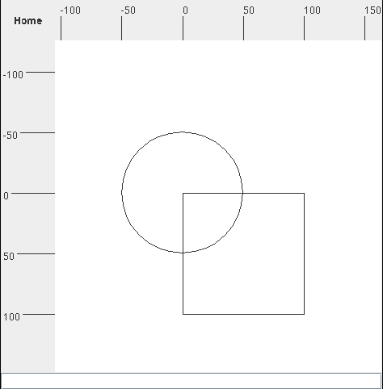
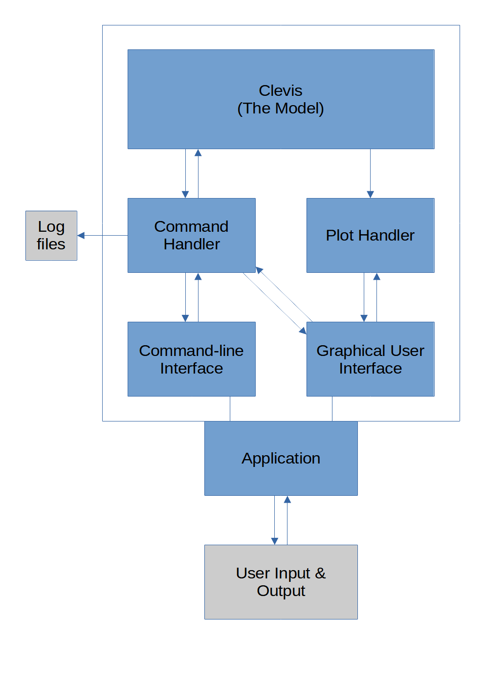

<h1>clevis</h1>

_A minimalist CLI + GUI vector graphics software
with Java, Swing, and the MVC pattern_

## Quick start

If you use IntelliJ IDEA, please open this repo,
and use the configurations provided with this repo:
`CLI` for launching `clevis` in CLI mode,
`GUI` for GUI mode.
(You may need to install Java version 11,
which IntelliJ IDEA would do for you after a prompt.)

If you use VS Code, please open this repo,
then open any file in the `src/` folder,
and press <kbd>F5</kbd> to launch `clevis` in GUI mode.

## Features

- Accurate and versatile for graphical calculation
  - Supports up to 29 significant figures
  - 4 + 1 shapes with powerful geometric operations
  - Undo and redo support
- Two modes of user interface
  - CLI with coloured outputs
  - GUI with plotting support and smooth animations
- User-friendly interactions
  - Dynamic and helpful warning messages
  - Rulers for guide on GUI
- Helpful logs
  - Available in both `html` and `txt` formats

## Overall code architecture

## References and credits

This is an application created for a course project
at the Hong Kong Polytechnic University,
under the requirements of the COMP2021 Project Description.
While the initial concept of `clevis` is given,
the application design, structure, and implementation are all products of our independent efforts.

The code that drives `clevis` is written by Ho Man Hin,
while the unit test suite is written by Mok Ka Kiu,
and integration tests and bug searches are by Chui Wai Lam Nathan.
Ho Man Hin hereby expresses heartfelt gratitude
to these teammates' crucial efforts for a successful project.
